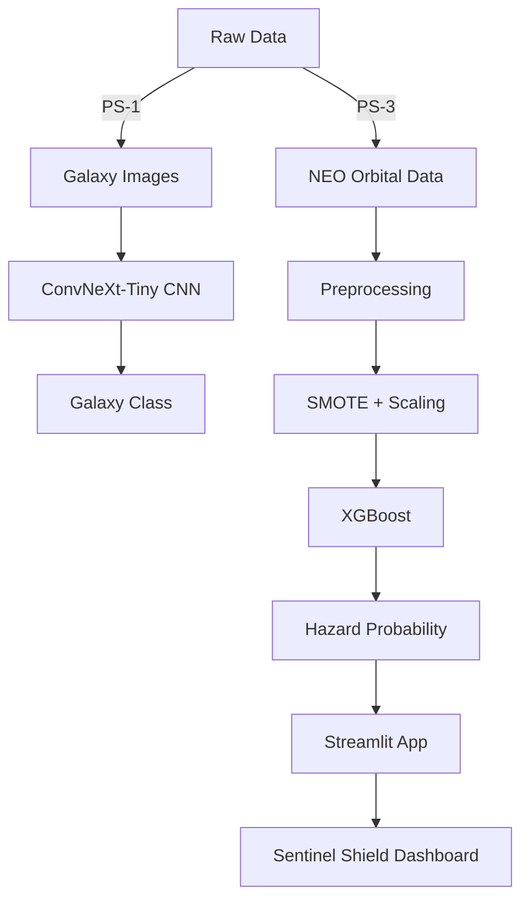

# 🛰️ SpaceCode 2026 — Team Dominators  
**STAC IIT Mandi Annual SpaceCode Hackathon**


> Two frontiers. One team. One codebase.  
> From galaxies billions of light-years away to asteroids grazing Earth, this repository contains our complete machine-learning systems built for **SpaceCode 2026**.

---

## 👥 Team Dominators

| Name | Roll No. | GitHub |
|------|--------|--------|
| **Aryan Sisodiya** | B25126 | [InfinityxR9](https://github.com/InfinityxR9) |
| **Daksh Rathi** | B25132 | [dakshrathi-india](https://github.com/dakshrathi-india) |
| **Priyanshu Baranwal** | B25165 | [priyanshubarnwal122-ai](https://github.com/priyanshubarnwal122-ai) |

---

## 📁 Repository Structure

```

SpaceCode/
│
├── ps1/        # Galaxy Morphology Classification (Deep Learning)
├── ps3/        # Near-Earth Object Hazard Classification (ML + Physics)
│
├── SpaceCode_2026.pdf
├── run.txt
├── .gitignore
└── README.md

```

Each problem statement is a **fully reproducible scientific pipeline**.

---

# 🌌 PS-1 — Galaxy Morphology Classification

**Goal:**  
Classify galaxies into 10 morphological classes from 256×256 RGB images.

**Model:**  
ConvNeXt-Tiny CNN fine-tuned with class-balanced training.

**Dataset:**  
[HuggingFace — Xanadu00/autotrain-data-galaxy_classification](https://huggingface.co/datasets/Xanadu00/autotrain-data-galaxy_classification)

**Trained Model (300 MB Release):**  
[ML Model](https://github.com/InfinityxR9/SpaceCode/releases/download/ps1-v1/best_model.pth)

**Results:**

| Metric | Value |
|-------|------|
| Validation Accuracy | **87%** |
| Macro-F1 | **0.86** |

All training code, evaluation, robustness tests, figures and LaTeX report live in `ps1/`.

---

# ☄️ PS-3 — Sentinel Shield (Planetary Defense)

**Goal:**  
Automatically classify Near-Earth Objects (NEOs) as **Potentially Hazardous Objects (PHOs)**.

NASA physics definition:
```

MOID ≤ 0.05 AU
Absolute Magnitude (H) ≤ 22

```

**Dataset:**  
[NASA NEOWS (1950–2025), 375,659 objects ](https://drive.google.com/file/d/1BN6ro6Qtfd4j7tUtlrgVzZ_Ts3axj6v0/view)

**Model:**  
XGBoost + SMOTE + log-transformed physical features.

**Performance:**

| Metric | Value |
|--------|-------|
| ROC-AUC | **0.999999** |
| Recall | **0.9996** |
| Precision | **1.0000** |

The model learns the **orbital hazard cliff** at MOID ≈ 0.05 AU.

---

## 🌐 Live Deployment — Sentinel Shield

https://spacecode-ps3.streamlit.app/

Features:
- Load real NASA asteroids  
- Adjust MOID, magnitude and eccentricity  
- Get real-time hazard probability  
- Compare physics vs ML decision  

This is a real planetary-defense console.

---

## 🧠 System Architecture



---

## 📜 Reports

| Problem | LaTeX            | PDF              |
| ------- | ---------------- | ---------------- |
| PS-1    | `ps1/report.tex` | `ps1/report.pdf` |
| PS-3    | `ps3/report.tex` | `ps3/report.pdf` |

---

## 🧭 What This Repository Represents

PS-1 lets us **see structure** in the universe.
PS-3 lets us **predict danger** in it.

One system reads galaxies.
The other guards Earth.

This is **SpaceCode 2026**.

---
<h3 style="text-align:center">
Made with curiosity, caffeine, and code by

**Aryan Sisodiya, Daksh Rathi & Priyanshu Baranwal**
</h3>